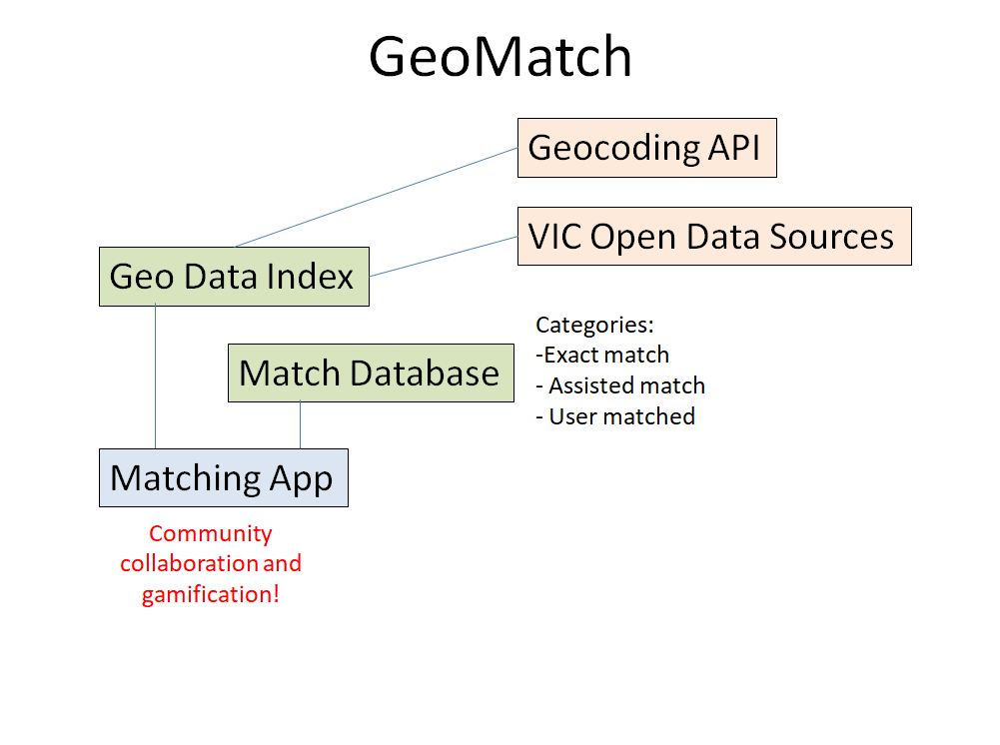

## GeoMatch

### Description

GeoMatch is a utility that helps in linking various location-based data together.

It has the following components:

Geo Data Index. This index contains geolocated records that links to external data sources, such as the vast address-based open data repositories. Data sources that have addresses, but not geolocation, will use address-to-geolocation translation services such as Google Maps API.

Match Database. This contains matches made. Matches fall under the following categories:
- exact match. Entries in the geo data index that are declared to be in the same location by meeting certain standards (ie., within X distance) are linked.
- assisted match. The system identifies candidates for matching, but requires a human to confirm that it is to be linked.
- user matched. Data not linked by any of the prior processes can be user matched. Using visual tools, users can tag entries that appear to be in the same location together.

Matching App. This provides the user interface to crowdsource the effort to link data together. By presenting data in maps, users can link entries together. Contributions will be credited to the user, and the hope is that, just like Wikipedia, there will be a community of volunteers who will help link together data that software cannot. (Eventually, it is hoped that, eventually, ML/AI can do this too.) It can also be gamified so that users will be rewarded for their efforts.

### Data Story

Using software to match records together via addresses (and regex) are good, but have some limitations. Our proposal with GeoMatch is to utilize geolocation to bring them together. They may be done automatically, or may require human input. For the latter, crowdsourcing through volunteers may be a cost-effective way to achieve this.

### How GeoMatch Addresses the Challenge

GeoMatch is designed to address the challenge of connecting datasets with addresses in open data. It will use services like Google's Geocoding API, and will involve various methods: automated, hybrid (human verified), and user contributed.
